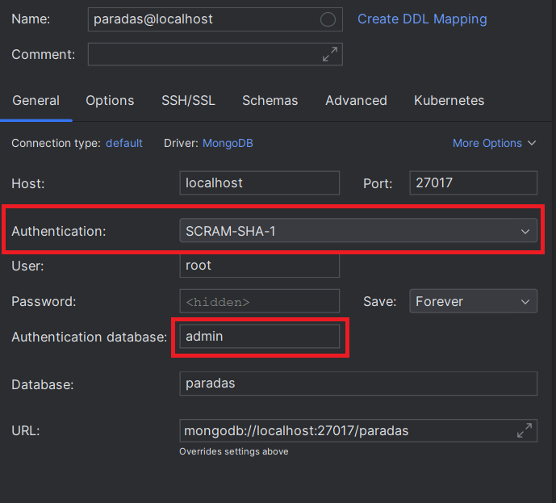
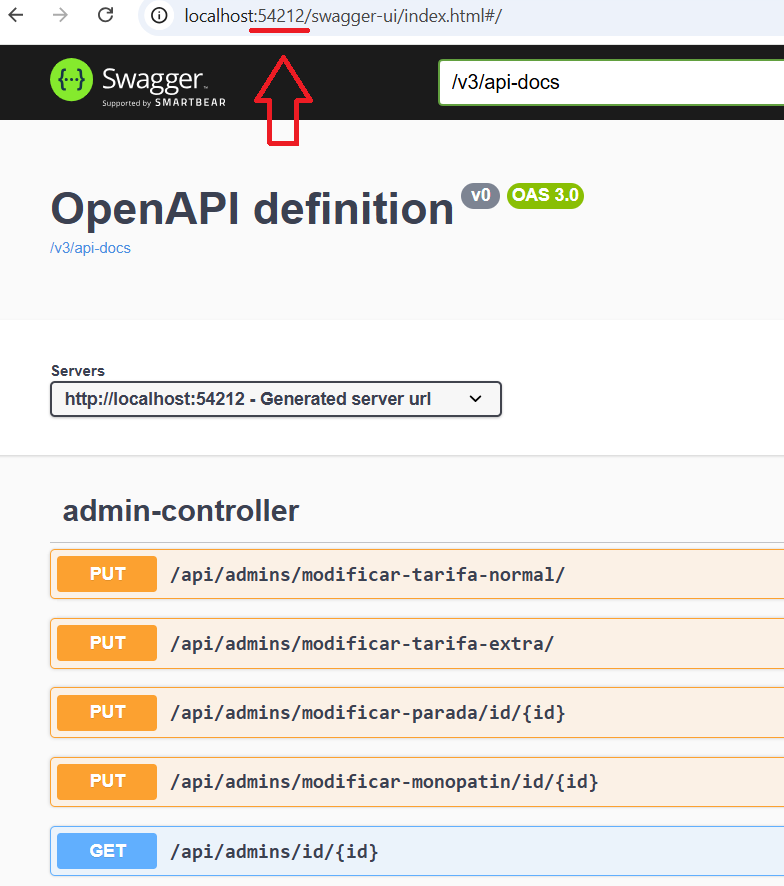
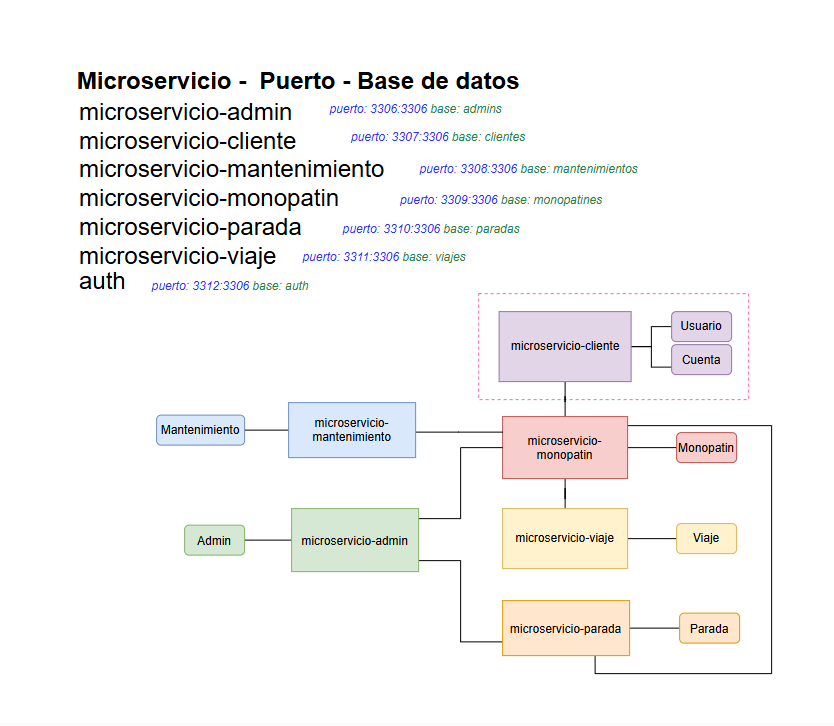
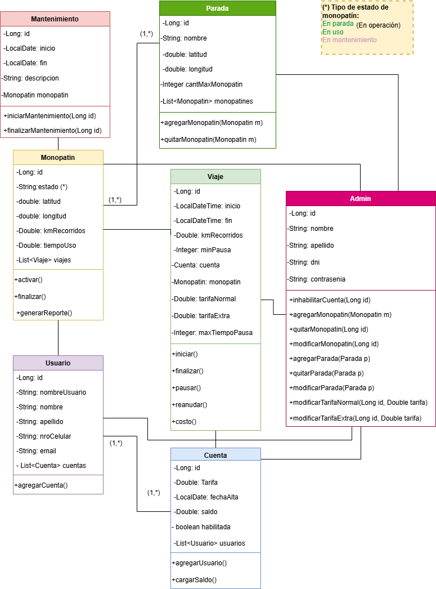
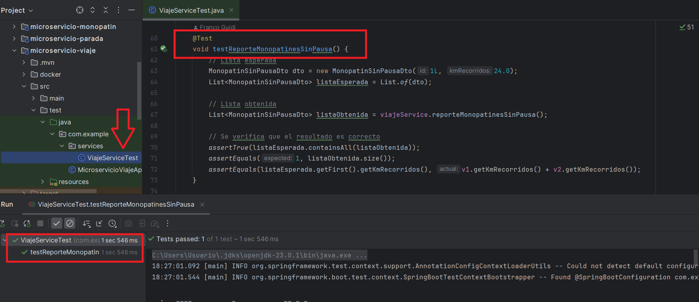

# Trabajo Práctico Especial: Aplicación para Monopatines Eléctricos

**Asignatura**: Arquitecturas Web (TUDAI)

**Autores**: Aguerralde Felicitas, de la Torre Giuiliana, Gramuglia Eliana, Guidi Franco, Rodríguez Julián

## Descripción del proyecto
Este proyecto tiene como objetivo diseñar e implementar un sistema de gestión para monopatines eléctricos 
utilizando microservicios con Spring Boot. La aplicación está compuesta por múltiples microservicios 
independientes, cada uno responsable de una funcionalidad específica.

## Microservicios involucrados
- `microservicio-admin`: Gestión administrativa de monopatines y usuarios.
- `microservicio-cliente`: Gestión de usuarios y cuentas.
- `microservicio-mantenimiento`: Gestión de mantenimiento de los monopatines.
- `microservicio-monopatin`: Gestión y seguimiento de los monopatines.
- `microservicio-parada`: Gestión de las paradas donde pueden estacionarse los monopatines.
- `microservicio-viaje`: Registro y control de los viajes realizados con los monopatines.

---

## Instrucciones para ejecutar el proyecto
### Pre-requisitos
Antes de ejecutar los microservicios, asegurarse de tener configurado y ejecutándose Docker para cada microservicio.

### Pasos para iniciar los microservicios
1. Levantar los contenedores Docker que se encuentran dentro de cada microservicio.
2. Secuencia de ejecución de los microservicios:
   - ConfigServiceApplication
   - EurekaServiceApplication
   - GatewayApplication
   - Inicio de microservicios:
     - microservicio-monopatin
     - microservicio-admin
     - microservicio-cliente
     - microservicio-mantenimiento
     - microservicio-parada
     - microservicio-viaje


> Nota 1: Se accede a cada microservicio a través del Gateway (puerto 2000).

> Nota 2: En la raíz del proyecto se encuentra `postman_collection.json` con los endpoints del sistema y algunos ejemplos de uso.

> Nota 3: Para acceder a las bases de datos MySQL, utilizar las credenciales `usuario=root` y `contraseña=1234`

> Nota 4: Para acceder a la base de datos MongoDB, utilizar las credenciales `usuario=root` y `contraseña=1234`, con autenticación de tipo SCRAM-SHA-1:
>
> 

> Nota 5: Para acceder a la documentación de OpenAPI, utilizar los puertos dinámicos de cada microservicio como se muestra a continuación:
>
> 

---

### Diagrama de microservicios
   

---

### Diagrama de tablas


--- 
### Servicios CRUD 

Ejemplos de servicios CRUD realizados sobre el microservicio de monopatines (puede ser realizado en cualquier otro 
microservicio):

#### 1. Recuperar todos los monopatines
- **Método**: `GET`
- **URL**: `http://localhost:2000/api/monopatines/`
- **Descripción**: Obtiene un listado de todos los monopatines. 
- **Respuesta de ejemplo**:
```json
[
	{
		"id": 1,
		"estado": "En uso",
		"latitud": 41.71,
		"longitud": 44.00,
		"kmRecorridos": 1200.5,
		"tiempoUso": 2000.0
	},
	{
		"id": 2,
		"estado": "En parada",
		"latitud": 41.75,
		"longitud": 44.05,
		"kmRecorridos": 300.2,
		"tiempoUso": 150.0
	}
]
```

#### 2. Recuperar un monopatín por ID
- **Método**: `GET`
- **URL**: `http://localhost:2000/api/monopatines/id/{id}`
- **Descripción**: Recupera un monopatín específico según su ID.
- **Parámetros de URL**:
  - id: ID del monopatín.
- **Respuesta de ejemplo**
```json
{
	"id": 1,
	"estado": "En uso",
	"latitud": 41.71,
	"longitud": 44.00,
	"kmRecorridos": 1200.5,
	"tiempoUso": 2000.0
}
```

#### 3. Modificar un monopatín
- **Método**: `PUT`
- **URL**: `http://localhost:2000/api/monopatines/id/{id}`
- **Descripción**: Modifica las propiedades de un monopatín existente.
- **Cuerpo de la solicitud (JSON)**:
```json
{
	"estado": "En parada",
	"latitud": 41.71,
	"longitud": 44.00,
	"kmRecorridos": 1250.5,
	"tiempoUso": 2220.5
}
```

- **Respuesta de ejemplo**:
```json
{
	"id": 1,
	"estado": "En parada",
	"latitud": 41.71,
	"longitud": 44.00,
	"kmRecorridos": 1250.5,
	"tiempoUso": 2220.5
}
```

#### 4. Eliminar un monopatín
- **Método**: `DELETE`
- **URL**: `http://localhost:2000/api/monopatines/id/{id}`
- **Descripción**: Elimina un monopatín de la base de datos.
- **Respuesta de ejemplo**:
```json
{
	"id": 1,
	"estado": "Eliminado",
	"latitud": 41.71,
	"longitud": 44.00,
	"kmRecorridos": 1250.5,
	"tiempoUso": 2220.5
}
```
---

## Servicios propios del sistema:

### Gestiones específicas del administrador

#### 1. Crear un monopatín
- **Método**: `POST`
- **URL**: `http://localhost:2000/api/admins/crear-monopatin/`
- **Descripción**: Crea un nuevo monopatín en el sistema.
- **Cuerpo de la solicitud (JSON)**:
```json
{
	"estado": "En uso",
	"latitud": 41.71,
	"longitud": 44.00,
	"kmRecorridos": 1200.5,
	"tiempoUso": 2000.0
}
```

- Respuesta de ejemplo:
```json
{
	"id": 1,
	"estado": "En uso",
	"latitud": 41.71,
	"longitud": 44.00,
	"kmRecorridos": 1200.5,
	"tiempoUso": 2000.0
}
```

#### 2. Modificar un monopatín
- **Método**: `PUT`
- **URL**: `http://localhost:2000/api/admins/modificar-monopatin/id/{id}`
- **Descripción**: Modifica las propiedades de un monopatín específico.
- **Cuerpo de la solicitud (JSON)**:
```json
   {
   "estado": "En mantenimiento",
   "latitud": 41.75,
   "longitud": 44.05,
   "kmRecorridos": 1300.0,
   "tiempoUso": 2100.0
   }
```

- **Respuesta de ejemplo**:
```json
{
	"id": 1,
	"estado": "En mantenimiento",
	"latitud": 41.75,
	"longitud": 44.05,
	"kmRecorridos": 1300.0,
	"tiempoUso": 2100.0
}
```
#### 3. Eliminar un monopatín
- **Método**: `DELETE`
- **URL**: `http://localhost:2000/api/admins/eliminar-monopatin/id/{id}`
- **Descripción**: Elimina un monopatín del sistema.
- **Respuesta de ejemplo**:
```json
{
	"id": 1,
	"estado": "Eliminado",
	"latitud": 41.75,
	"longitud": 44.05,
	"kmRecorridos": 1300.0,
	"tiempoUso": 2100.0
}
```

#### 4. Crear una parada
- **Método**: `POST`
- **URL**: `http://localhost:2000/api/admins/crear-parada/`
- **Descripción**: Crea una nueva parada en el sistema, donde los monopatines pueden ser estacionados.

- **Cuerpo de la Solicitud (JSON)**:
```json
{
	"nombre": "Parada Central",
	"latitud": 41.736,
	"longitud": -74.000
}
```

- **Respuesta exitosa (200 OK)**:
```json
{
	"nombre": "Parada Central",
	"latitud": 41.736,
	"longitud": -74.000,
	"cantMaxMonopatin": 20
}
```

- **Mensaje de error (si no se puede crear la parada)**:
```
"No se pudo crear la parada. Por favor, verifique los datos ingresados."
```

#### 5. Modificar una parada
- **Método**: `PUT`
- **URL**: `http://localhost:2000/api/admins/modificar-parada/id/{id}`
- **Descripción**: Modifica los detalles de una parada existente utilizando su ID.
- **Parámetros de URL**:
  - `id`: El ID de la parada a modificar.

- **Cuerpo de la solicitud (JSON)**:
```json
{
	"nombre": "Parada Norte",
	"latitud": 41.740,
	"longitud": -74.005,
	"cantMaxMonopatin": 20
}
```

- **Respuesta exitosa (200 OK)**:
```json
{
	"nombre": "Parada Norte",
	"latitud": 41.740,
	"longitud": -74.005,
	"cantMaxMonopatin": 20
}
```

- **Mensaje de error (si no se puede modificar la parada)**:
```
"No se pudo modificar la parada con ID 1. Verifique que el ID sea correcto y que los datos sean válidos."
```

#### 6. Eliminar una parada
- **Método**: `DELETE`
- **URL**: `http://localhost:2000/api/admins/eliminar-parada/id/{id}`
- **Descripción**: Elimina una parada del sistema usando su ID.
- **Parámetros de URL**:
  - `id`: El ID de la parada a eliminar.
- **Respuesta exitosa (200 OK)**:
```json
{
	"nombre": "Parada Norte",
	"latitud": 41.740,
	"longitud": -74.005,
	"cantMaxMonopatin": 20
}
```

- **Mensaje de error (si no se puede eliminar la parada)**:
```
"No se pudo eliminar la parada con ID 1. Asegúrese de que la parada existe y que no está siendo utilizada."
```


### Gestiones de mantenimiento
#### 1. Inicio de mantenimiento de un monopatín dado
- **Método**: `PUT`
- **URL**: `http://localhost:2000/api/mantenimientos/iniciar/1`
- **Respuesta exitosa (200 OK)**:
```
"Mantenimiento del monopatín id 1 iniciado"
```

- **Mensaje de error (si no se encuentra el monopatín)**:
```
"No se encontró el monopatín con ID 1"
```

#### 2. Finalización de mantenimiento de un monopatín dado
- **Método**: `PUT`
- **URL**: `http://localhost:2000/api/mantenimientos/finalizar/1`
- **Respuesta exitosa (200 OK)**:
```
"Mantenimiento del monopatín id 1 finalizado"
```

- **Mensaje error**:
```
"No se encontró el monopatín con ID 1"
```

---

## Ejercicio 3 del TPE

#### 3a) "Como encargado de mantenimiento quiero poder generar un reporte de uso de monopatines por  kilómetros para establecer si un monopatín requiere de mantenimiento. Este reporte debe poder  configurarse para incluir (o no) los tiempos de pausa".
- **Método**: `GET`
- **URL**: `http://localhost:2000/api/mantenimientos/monopatines-reporte?kmMantenimiento=200.3`
- Parámetros de consulta:
  - `kmMantenimiento=200.3`
- **Respuesta exitosa**: JSON con monopatines


#### 3b) "Como administrador quiero poder anular cuentas para inhabilitar el uso momentáneo de la  misma."
- **Método**: `GET`
- **URL**: `http://localhost:2000/api/admins/estado-cuenta/1/estado/true`
- **Respuesta exitosa**: `"Cuenta con ID 1 habilitada = true"`
- **Mensaje de error:** `"No se encontró la cuenta con ID 1"`


#### 3c) "Como administrador quiero consultar los monopatines con más de X viajes en un cierto año."
- **Método**: `GET`
- **URL**: `http://localhost:2000/api/admins/cant-monopatines/cant-viajes/{cantViajes}/anio/{anio}`
- **Respuesta exitosa**: JSON con ID de monopatín y cantidad de viajes.


#### 3d) "Como administrador quiero consultar el total facturado en un rango de meses de cierto año."
- **Método**: `GET`
- **URL:** `http://localhost:2000/api/admins/total-facturado`
- Parámetros de consulta
  - `anio=2024 `
  - `mesInicio=2`
  - `mesFin=3`
- **Respuesta exitosa**: Mensaje con el total facturado.


#### 3e) "Como administrador quiero consultar la cantidad de monopatines actualmente en operación, versus la cantidad de monopatines actualmente en mantenimiento."
- **Método**: `GET`
- **URL**: `http://localhost:2000/api/admins/monopatines/cantidad-estado`
- **Respuesta exitosa**: Devuelve la cantidad de monopatines en operación y la cantidad de monopatines en mantenimiento.


#### 3f) "Como administrador quiero hacer un ajuste de precios, y que a partir de cierta fecha el sistema habilite los nuevos precios."
- **Método**: `PUT`
- **URLs**: 
  - `http://localhost:2000/api/admins/monopatines/modificar-tarifa-normal/`
  - `http://localhost:2000/api/admins/monopatines/modificar-tarifa-extra/`
- **Cuerpo**:
```json
{
	"nuevoValor": 1500.0,
	"fechaActualizacion": "2024-11-10"
}
```  

- **Respuestas exitosas:** 
  - `"Nuevo valor de tarifa normal: 1500.0"`
  - `"Nuevo valor de tarifa extra: 2000.0"`

- **Mensajes de error:** 
  - `"No se pudo modificar el valor de la tarifa normal"`
  - `"No se pudo modificar el valor de la tarifa extra"`


#### 3g) "Como usuario quiero un listado de los monopatines cercanos a mi zona, para poder encontrar  un monopatín cerca de mi ubicación"
- **Método**: `GET`
- **URL:** `http://localhost:2000/api/usuarios/monopatines-cercanos?latitud=200.3&longitud=54.9`
- **Parámetros de consulta**:
  - `latitud=200.3` 
  - `longitud=54.9`
- **Respuesta exitosa:** Devuelve una lista de monopatines.
- **Mensaje de error:** `"Error al consultar monopatines cercanos."`

---

## Tests unitarios
- Se implementaron test unitarios en los microservicios `admin`, `monopatin` y `viaje`.
- Ubicación de tests en el proyecto (por ejemplo, en el microservicio `viaje`):



---