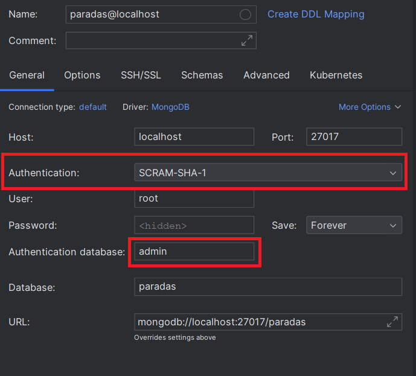
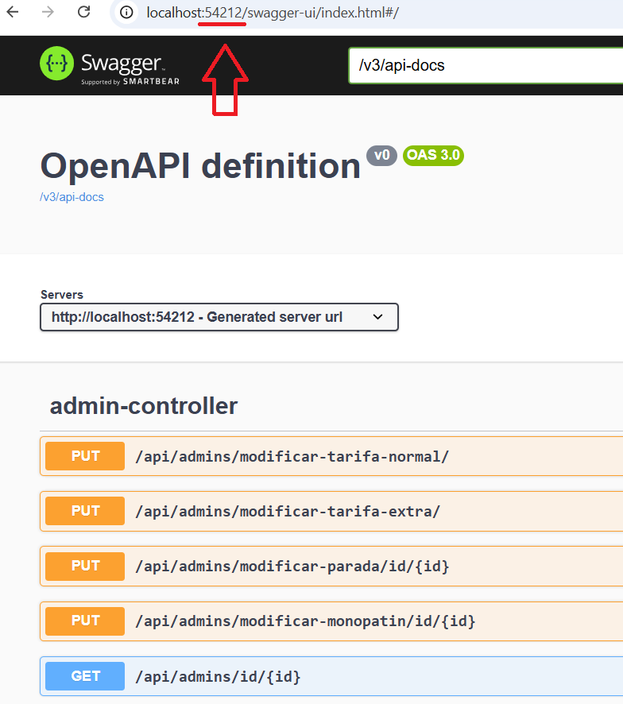
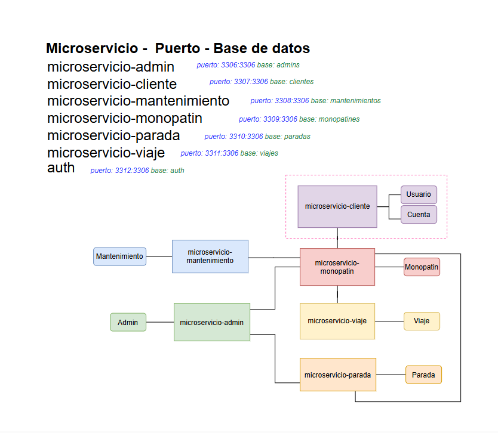
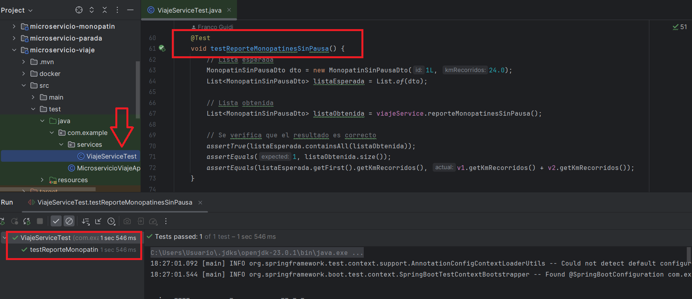

# Arquitecturas Web (TUDAI)
# Trabajo Práctico Especial: Aplicación para Monopatines Eléctricos

### Descripción
Este proyecto consta de un diseño e implementación de un sistema abordado con la estructura de microservicios utilizando SpringBoot.
El servicio está compuesto por los microservicios: 
* microservicio-admin (MySQL)
* microservicio-cliente (MySQL)
* microservicio-mantenimiento (MySQL)
* microservicio-monopatin (MySQL)
* microservicio-parada (MongoDB)
* microservicio-viaje (MySQL)

>***Nota 1:*** En la raíz del proyecto se encuentra **postman_collection.json** con los endpoints

>***Nota 2:*** Para acceder a las bases de datos MySQL, utilizar **usuario = root** y **contraseña = 1234**

> ***Nota 3:*** Para acceder a la base de datos MongoDB, utilizar **usuario = root** y **contraseña = 1234, con autenticación de tipo SCRAM-SHA-1**
>
> 

> ***Nota 4:*** Para acceder a la documentación de OpenAPI, utilizar los puertos dinámicos de cada microservicio como se muestra a continuación:
> 
> 

***Importante!!!*** Antes de correr los microservicios asegurarse de levantar todos los archivos Docker contenidos en cada microservicio
***Luego correr cada aplicación en este orden:*** ConfigServiceApplication, EurekaServiceApplication, GatewayApplication y luego cada microservicio. De esta manera podrá realizar las consultas con los datos precargados.

#### Diagrama de microservicios:

#### Diagrama de tablas:

### CRUD de microservicio-monopatin. Ejemplo de uso accediendo desde el Gateway (puerto: 2000), mediante autenticación

### Gestión de Monopatines (puerto 2000)

* **A) Recuperar todos los monopatines**
* **Método:**  GET
	* **URL:** http://localhost:2000/api/monopatines/
	* **Respuesta:** JSON con todos los monopatines
    * Roles admitidos: ADMIN, MANTENIMIENTO

	
* **B) Recuperar un monopatines por id**
* **Método:**  GET
	* **URL:** http://localhost:2000/api/monopatines/id/1
	* **Respuesta:** JSON con un monopatín
    * Roles admitidos: ADMIN, MANTENIMIENTO

* **C) Modificar un monopatin:**
	* **Método:** GET
	* **URL:** http://localhost:2000/api/monopatines/id/1
	* **Cuerpo:** Ejemplo de JSON:
	  {
	  "estado": "En parada",
	  "latitud": 41.71,
	  "longitud": 44.00,
	  "kmRecorridos": 1250.5,
	  "tiempoUso": 2220.5
	  }
	* **Respuesta:** JSON con el monopatin creado
	* Roles admitidos: ADMIN, MANTENIMIENTO

* **C) Eliminar un monopatin:**
	* **Método:** DELETE
	* **URL:** http://localhost:2000/api/monopatines/id/1
	* **Respuesta:** JSON con el monopatin eliminado	
    * Roles admitidos: ADMIN, MANTENIMIENTO

---

## Servicios propios del sistema de gestión de monopatines eléctricos:

### Gestiones específicas del administrador

*  **El administrador crea un monopatín**
* **Método:** POST
	* **URL:** http://localhost:2000/api/admins/crear-monopatin/
	* **Respuesta Ok:** JSON con el monopatin creado
	* **Mensaje error:** Mensaje: "No se pudo crear el monopatín."
	* Roles admitidos: ADMIN, MANTENIMIENTO
	
	
*  El administrador modifica un monopatín
* **Método:** PUT
	* **URL:** http://localhost:2000/api/admins/modificar-monopatin/id/1
	* **Respuesta Ok:** JSON con el monopatin modificado
	* **Mensaje error:** Mensaje: "No se pudo modificar el monopatín con ID 1"
	* Roles admitidos: ADMIN, MANTENIMIENTO

*  El administrador elimina un monopatín
* **Método:** DELETE
	* **URL:** http://localhost:2000/api/admins/eliminar-monopatin/id/1
	* **Respuesta Ok:** JSON con el monopatin eliminado
	* **Mensaje error:** Mensaje: "No se pudo eliminar el monopatín con ID 1"
	* Roles admitidos: ADMIN

*  El administrador crea una parada
* **Método:** POST
	* **URL:** http://localhost:2000/api/admins/crear-parada/
	* **Respuesta Ok:** JSON con la parada creada
	* **Mensaje error:** Mensaje: "No se pudo crear la parada."
	* Roles admitidos: ADMIN

*  El administrador modifica una parada
* **Método:** PUT
	* **URL:** http://localhost:2000/api/admins/modificar-parada/id/1
	* **Respuesta Ok:** JSON con la parada modificada
	* **Mensaje error:** Mensaje: "No se pudo modificar la parada con ID 1"
	* Roles admitidos: ADMIN

*  El administrador elimina una parada
* **Método:** DELETE
	* **URL:** http://localhost:2000/api/admins/eliminar-parada/id/1
	* **Respuesta Ok:** JSON con la parada eliminada
	* **Mensaje error:** Mensaje: No se pudo eliminar la parada con ID 1"
	* Roles admitidos: ADMIN

### Gestiones de mantenimiento
*  El encargado de mantenimiento inicia un mantenimiento
* **Método:** PUT
	* **URL:** http://localhost:2000/api/mantenimientos/iniciar/1
	* **Respuesta Ok:** Mensaje: "Mantenimiento del monopatín id 1 iniciado"
	* **Mensaje error:** Mensaje: "No se encontró el monopatin con ID 1"
	* Roles admitidos: MANTENIMIENTO

*  El encargado de mantenimiento finaliza un mantenimiento
* **Método:** PUT
	* **URL:** http://localhost:2000/api/mantenimientos/finalizar/1
	* **Respuesta Ok:** Mensaje: "Mantenimiento del monopatín id 1 finalizado"
	* **Mensaje error:** Mensaje: "No se encontró el monopatin con ID 1"
	* Roles admitidos: MANTENIMIENTO

* Ejercicio 3 - a. Como encargado de mantenimiento quiero poder generar un reporte de uso de monopatines por  kilómetros para establecer si un monopatín requiere de mantenimiento. Este reporte debe poder  configurarse para incluir (o no) los tiempos de pausa.
* **Método:** GET
	* **URL:** http://localhost:2000/api/mantenimientos/monopatines-reporte?kmMantenimiento=200.3
    * 	Parámetros de consulta:
	* kmMantenimiento=200.3
	* **Respuesta Ok:** JSON con monopatines
	* Roles admitidos: MANTENIMIENTO

*   Ejercicio 3 - b)  Como administrador quiero poder anular cuentas para inhabilitar el uso momentáneo de la  misma.
* **Método:** GET
	* **URL:** http://localhost:2000/api/admins/estado-cuenta/1/estado/true
	* **Respuesta Ok:** Mensaje: "Cuenta con ID 1 habilitada = true
    * **Mensaje error:** Mensaje: "No se encontró la cuenta con ID 1"
	* Roles admitidos: ADMIN

*   Ejercicio 3 - c)  Como administrador quiero consultar los monopatines con más de X viajes en un cierto año.
* **Método:** GET
	* **URL:** http://localhost:2000/api/admins/cant-monopatines/cant-viajes/{cantViajes}/anio/{anio}
	* **Respuesta Ok:** Json con id de monopatin y cantidad de viajes.
	* Roles admitidos: ADMIN

*   Ejercicio 3 - d) Como administrador quiero consultar el total facturado en un rango de meses de cierto año.
* **Método:** GET
	* **URL:** http://localhost:2000/api/admins/total-facturado
    * Parámetros de consulta
    * anio=2024
    * mesInicio=2
    * mesFin=3
	* **Respuesta Ok:** Mensaje con el total facturado.
	* Roles admitidos: ADMIN

*   Ejercicio 3 - e) Como administrador quiero consultar la cantidad de monopatines actualmente en operación,  versus la cantidad de monopatines actualmente en mantenimiento
* **Método:** GET
	* **URL:** http://localhost:2000/api/admins/monopatines/cantidad
	* **Respuesta Ok:** Devuelve un numero entero con la cantidad de monopatines en operación y un entero de monopatines en mantenimiento
	* Roles admitidos: ADMIN

*   Ejercicio 3 - f. Como administrador quiero hacer un ajuste de precios, y que a partir de cierta fecha el sistema  habilite los nuevos precios.
* **Método:** PUT
	* * **Cuerpo:** Ejemplo de JSON:
	{
  		"nuevoValor": 1500.0,
  		"fechaActualizacion": "2024-11-10"
  	}
	* **URL:** http://localhost:2000/api/admins/modificar-tarifa-normal/
	* **Respuesta Ok:** "Nuevo valor de tarifa normal: 1500.0"
	* **Mensaje error:** "No se pudo modificar el valor de la tarifa normal"
	* Roles admitidos: ADMIN

* **Método:** PUT
	* * **Cuerpo:** Ejemplo de JSON:
		{
		"nuevoValor": 2000.0,
		"fechaActualizacion": "2024-11-09"
		}
	* **URL:** http://localhost:2000/api/admins/modificar-tarifa-extra/
	* **Respuesta Ok:** "Nuevo valor de tarifa extra: 2000.0"
	* **Mensaje error:** "No se pudo modificar el valor de la tarifa extra"
	* Roles admitidos: ADMIN

*   Ejercicio 3 - g. Como usuario quiero un listado de los monopatines cercanos a mi zona, para poder encontrar  un monopatín cerca de mi ubicación
* **Método:** GET
	* * Parámetros de consulta:
    * latitud=200.3
    * longitud=54.9
	* **URL:** http://localhost:2000/api/usuarios/monopatines-cercanos?latitud=200.3&longitud=54.9
	* **Respuesta Ok:** Devuelve una lista de monopatines
	* **Mensaje error:** "Error al consultar monopatines cercanos."
	* Roles admitidos: ADMIN, USER

---
## Test
Se implementaron test unitarios en los microservicios: admin, monopatín y viaje.

---
* *Autores: Aguerralde Felicitas, De La Torre Giuiliana, Gramuglia Eliana, Guidi Franco, Rodriguez Farias Julian*